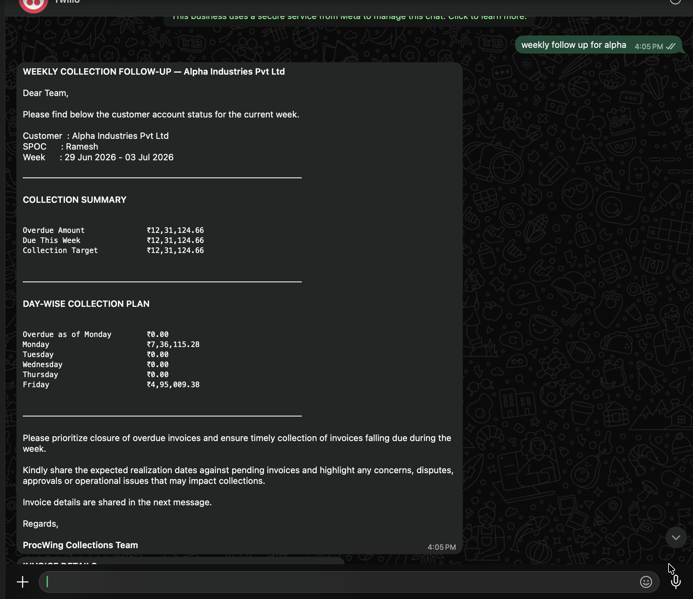
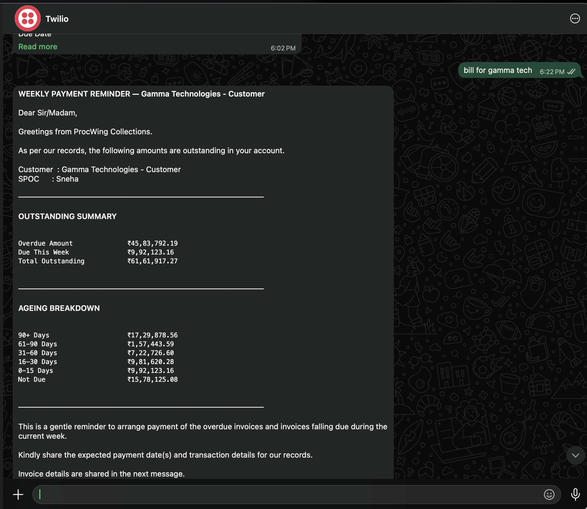
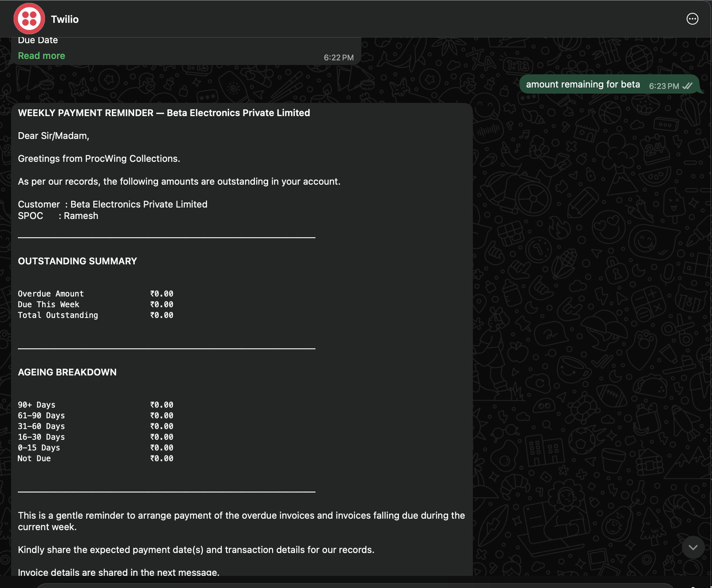
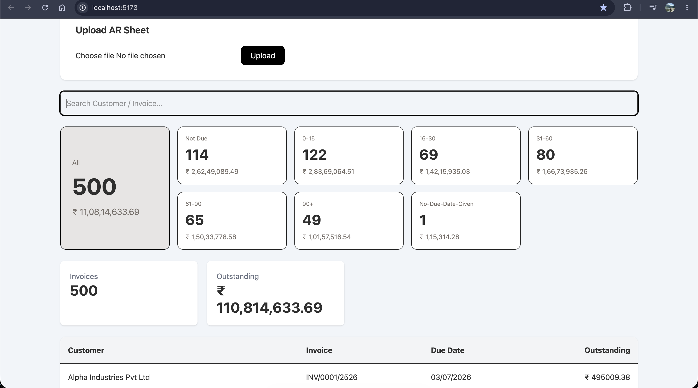

# ~ WhatsApp Collections Agent ~ 

An Accounts Receivable (AR) portal with a conversational WhatsApp agent.

The application allows users to upload an AR Excel sheet, stores invoice records, displays them through a searchable dashboard, and answers natural language WhatsApp queries for customer payment and collection reports.

---

## Features

### AR Portal

- Upload AR sheet (.xlsx)
- Parse and store invoice records in MongoDB
- Dashboard with:
  - Invoice count
  - Outstanding amount
  - Bucket-wise ageing filters
  - Customer search
  - Invoice listing

Ageing buckets:

- Not Due
- 0–15 Days
- 16–30 Days
- 31–60 Days
- 61–90 Days
- 90+ Days

---

### WhatsApp Agent

Supports free-text queries such as:

```
Payment schedule for Alpha

Outstanding for Beta

Remaining amount for Gamma

Weekly collection follow up for Delta

Give me payment schedule for Epsilon
```

The agent performs:

- Intent detection (Payment / Collection)
- Fuzzy customer matching
- Report generation
- WhatsApp formatted response

---

## Reports

### 1. Weekly Payment Reminder

Returns:

- Customer
- SPOC
- Overdue Amount
- Amount Due This Week
- Total Outstanding
- Ageing Breakdown
- Invoice Details (first 5 invoices)

---

### 2. Weekly Collection Follow-Up

Returns:

- Customer
- SPOC
- Week
- Overdue Amount
- Due This Week
- Collection Target
- Day-wise Collection Plan
- Invoice Details (first 5 invoices)

---

## Tech Stack

### Frontend

- React
- Vite
- Tailwind CSS

### Backend

- Node.js
- Express.js

### Database

- MongoDB
- Mongoose

### File Parsing

- XLSX

### WhatsApp

- Twilio WhatsApp Sandbox

### Utilities

- date-fns
- Fuse.js (Fuzzy Search)

---

## Installation

### Clone repository

```bash
git clone <repo-url>
```

---

### Backend

```bash
cd server

npm install

npm run dev
```

Runs on

```
http://localhost:5010
```

---

### Frontend

```bash
cd client

npm install

npm run dev
```

Runs on

```
http://localhost:5173
```

---

## Environment Variables

Create a `.env` inside the server folder.

```
PORT=5010

MONGO_URI=your_mongodb_connection

TWILIO_ACCOUNT_SID=xxxxxxxx

TWILIO_AUTH_TOKEN=xxxxxxxx

TWILIO_WHATSAPP_NUMBER=whatsapp:+14155238886
```

---
## ngrok Setup

1. Start the backend server.

```bash
cd server
npm run dev
```

2. Start ngrok.

```bash
ngrok http 5010
```

3. Copy the generated forwarding URL.

Example:

```
https://punctuate-dipping-choice.ngrok-free.dev
```

4. In the Twilio WhatsApp Sandbox, set the **WHEN A MESSAGE COMES IN** webhook to:

```
https://<your-ngrok-url>/api/whatsapp
```

Method:

```
POST
```

5. Send a WhatsApp message to the Twilio Sandbox number. If configured correctly, ngrok will log:

```
POST /api/whatsapp   200 OK
```

> **Note:** On the free ngrok plan, the public URL changes every time a new tunnel is started. Pls update the Twilio webhook accordingly.

---

## WhatsApp Setup

1. Create a Twilio WhatsApp Sandbox.
2. Connect your WhatsApp number using the sandbox code.
3. Expose the local server using ngrok.

Example:

```bash
ngrok http 5010
```

4. Configure the webhook:

```
POST
(eg:https://punctuate-dipping-choice.ngrok-free.dev/api.whatsapp)
https://<ngrok-url>/api/whatsapp
```

---

## Fuzzy Customer Matching

Customer names are matched using Fuse.js.

The following all resolve correctly:

```
Payment schedule for alpha

Outstanding for Alpha Industries

collection follow up beta

remaining amount gamma

payment eta
```

The user is not required to type the exact customer name.

---

## Edge Cases Handled

- Customer not found
- Missing Due Date
- Zero Outstanding customer
- Customer with all invoices Not Due
- Customer spanning multiple ageing buckets
- Free-text query parsing
- Invoice list limited to first 5 invoices for WhatsApp readability

---


## Sample Queries

```
Payment schedule for Alpha

Outstanding for Beta

Remaining amount for Gamma

Weekly collection follow up for Delta

Collection report for Zeta

Pending payment for Eta
```

---

## Future Improvements

- WhatsApp Cloud API
- Scheduled payment reminders
- PDF statement generation
- Export reports
- Multiple report types
- LLM-powered intent detection
- Conversation history

---

## sample imgs


### messaging agent (twilio free tier ofc)
 : customer01
 :customer02
 :customer03
### dashboard for invoices



